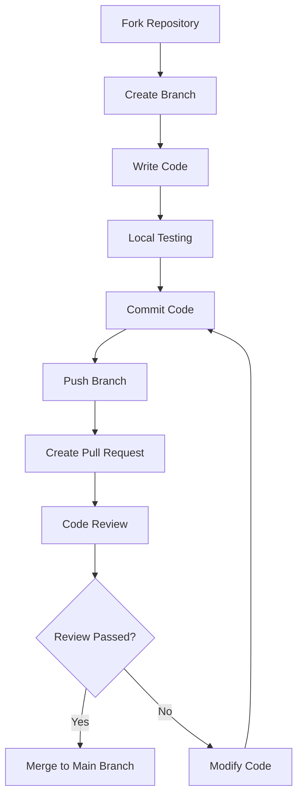

## Code of Conduct

This project adopts an open and friendly collaboration approach. By contributing, you agree to abide by the following principles:

- Respect all contributors
- Accept constructive criticism and suggestions
- Focus on what is best for the community
- Show empathy towards others

## How to Contribute

### Reporting Bugs

If you find a bug, please submit a report through [GitHub Issues](https://github.com/SSJ-ZYJ/Neoverse-Doc/issues). Before submitting:

1. Check if there is already an issue for the same problem
2. Describe the problem with a clear title
3. Provide reproduction steps, expected results, and actual results
4. Include relevant environment information (Node.js version, operating system, etc.)

### Suggesting New Features

New feature suggestions are welcome! Please submit them through [GitHub Issues](https://github.com/SSJ-ZYJ/Neoverse-Doc/issues) and describe in detail:

- The purpose and value of the feature
- Possible implementation approaches
- Whether there are alternative solutions

### Submitting Code

Submit code contributions via Pull Request, see [Pull Request Process](#pull-request-process) for details.

## Development Environment Setup

### Prerequisites

- **Node.js** >= 20
- **Bun** >= 1.0
- **Git**

### Installation Steps

```bash
# 1. Fork and clone the project
git clone https://github.com/<your-username>/ORS-site.git
cd ORS-site

# 2. Add upstream repository
git remote add upstream https://github.com/ORS-Origins/ORS-site.git

# 3. Install dependencies
bun install

# 4. Start development server
bun dev
```

Open `http://localhost:3000` in your browser to preview.

### Available Commands

| Command | Description |
| :--- | :--- |
| `bun dev` | Start development server (Turbopack) |
| `bun run build` | Production build |
| `bun run typecheck` | TypeScript type checking |
| `bun run lint` | Biome Lint check |
| `bun run format` | Biome format |
| `bun run check` | Biome format + Lint + auto-fix |

## Project Structure

```text
ORS-site/
```

## Code Standards

### Coding Principles

1. **No hardcoding**: All user-visible text must use i18n localization
2. **Add comments**: New code requires functional description comments
3. **Follow tech stack**: Use dependency versions defined in `package.json`
4. **Type safety**: Make full use of the TypeScript type system

### Code Style

This project uses Biome for code formatting and linting:

```bash
# Format code
bun run format

# Check and auto-fix
bun run check
```

### Naming Conventions

| Type | Convention | Example |
| :--- | :--- | :--- |
| File name | lowercase + hyphens | `guestbook.tsx` |
| Component name | PascalCase | `Guestbook` |
| Function name | camelCase | `getDictionary` |
| Constants | UPPER_SNAKE_CASE | `DEFAULT_LOCALE` |
| CSS class | lowercase + hyphens | `liquid-glass` |

## Commit Conventions

Commit message format: `<type>(<scope>): <subject>`

### Types

| Type | Description |
| :--- | :--- |
| `feat` | New feature |
| `fix` | Bug fix |
| `docs` | Documentation changes |
| `style` | Formatting changes (no code impact) |
| `refactor` | Code refactoring (no feature impact) |
| `test` | Test changes |
| `chore` | Build process or auxiliary tool changes |
| `ci` | Continuous integration related changes |
| `revert` | Revert to previous version |

### Examples

```text
feat(i18n): add Japanese language support
fix(search): fix search result highlight display issue
docs(readme): update installation steps
refactor(components): refactor Mermaid component rendering logic
```

### Commit Message Rules

- Use English for the summary
- Keep summary within 10 English words
- If there are many changes, list other details in the body
- Leave a blank line between body and summary

## Documentation Standards

### Document Naming

- Use English naming, related to document content
- Use underscores to separate words, e.g., `getting_started.md`
- Case-sensitive

### Document Language

- Initial documents only provide Simplified Chinese version
- English versions use `_en.md` suffix, e.g., `README_en.md`
- Code comments maintain bilingual habit (English on top, Chinese on bottom)

### Document Format

- Written in Markdown format
- Flowcharts use Mermaid syntax
- Code blocks use appropriate language identifiers
- Use half-width spaces between Chinese and English
- English keywords, commands, filenames wrapped in backticks

### Adding New Documents

1. Create `.md` or `.mdx` file in the corresponding directory under `content/docs/zh/`
2. Add frontmatter:

   ```md
   ---
   title: Page Title
   description: Page description
   author:
     - "Main Author(https://github.com/your-name)"
   contributors:
     - "Contributor(https://github.com/contributor-name)"
   ---
   ```

   `author` will be displayed as the main writer at the beginning of the document; `contributors` will be displayed at the end of the body as document contributors, and is compatible with the singular form `contributor`. Both support the `Name(https://github.com/name)` format to automatically display GitHub avatars.

3. Register the new page in `meta.json` of the corresponding directory
4. If an English version is needed, create the corresponding file in `content/docs/en/`

## Pull Request Process

### Pre-submission Checklist

- [ ] Related documentation has been updated
- [ ] `meta.json` has been updated (if adding new documents)
- [ ] Code passes type checking: `bun check`
- [ ] Code passes Lint check: `bun lint`
- [ ] Code has been formatted: `bun format`
- [ ] Local build succeeds: `bun run build`

### Process Steps



1. **Fork the repository**: Fork this project on GitHub

2. **Create a branch**: Create a feature branch from the `main` branch

   ```bash
   git checkout -b feat/your-feature-name
   ```

3. **Write code**: Develop according to code standards

4. **Local testing**: Ensure all checks pass

   ```bash
   bun run typecheck
   bun run check
   bun run build
   ```

5. **Commit code**: Write commit message according to commit conventions

   ```bash
   git add .
   git commit -m "feat(scope): feature description"
   ```

6. **Push branch**:

   ```bash
   git push origin feat/your-feature-name
   ```

7. **Create Pull Request**:
   - Create a Pull Request on GitHub
   - Fill in the PR template, describe the changes
   - Link related issues (if any)

8. **Code review**: Wait for maintainers to review, modify based on feedback

### PR Title Standards

PR titles should follow the same format as commit messages:

```text
feat(i18n): add Japanese language support
```

## Internationalization Guide

### Adding a New Language (Example)

1. Add language configuration in `src/lib/i18n.ts`:

   ```typescript
   export const i18n = defineI18n({
     locales: ['zh', 'en', 'ja'],  // Add 'ja'
     defaultLocale: 'zh',
   });
   ```

2. Create language pack file `ja.ts` in `src/dictionaries/`

3. Import and register in `src/dictionaries/index.ts`

4. Create `ja/` directory in `content/docs/` and translate documents

5. Add fumadocs UI translation in `src/lib/layout.shared.tsx`

### Translation Principles

- Maintain consistency of professional terminology
- Respect expression habits of target language
- Comments in code examples also need translation
- Keep Markdown format unchanged

---

Thank you again for your contribution to ORS! If you have any questions, feel free to contact us through [GitHub Issues](https://github.com/SSJ-ZYJ/Neoverse-Doc/issues) or [Email](mailto:me@shenshijun.space).
