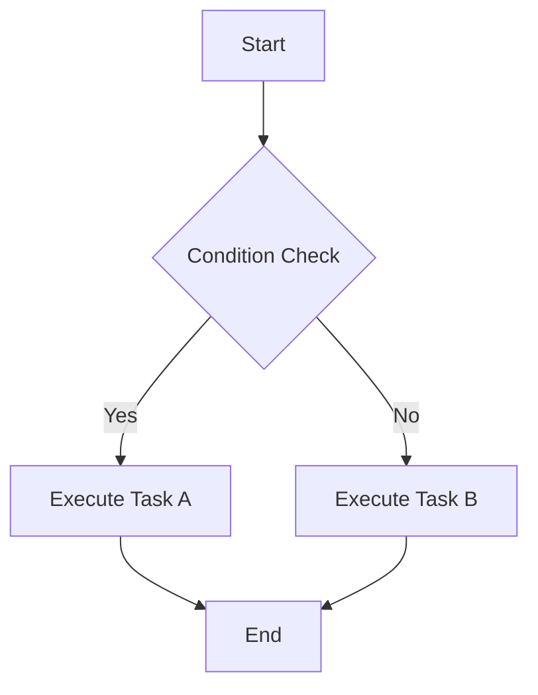
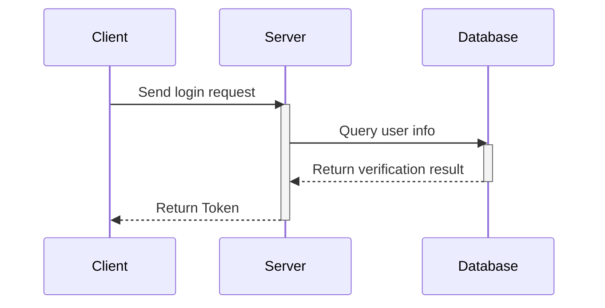
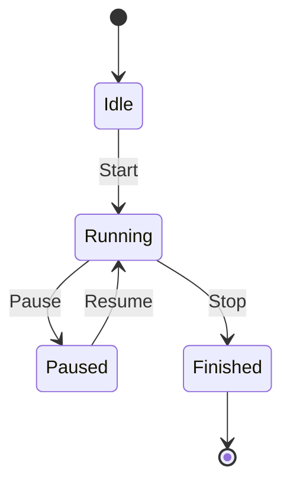

This document demonstrates basic Markdown, GitHub Flavored Markdown (GFM), and Mermaid diagram syntax.

## 1. Basic Markdown Syntax

### Headers

# Heading 1

## Heading 2

### Heading 3

#### Heading 4

```md
# Heading 1
## Heading 2
### Heading 3
#### Heading 4
```

### Emphasis

*Italic text*
**Bold text**
***Bold italic text***

```md
*Italic text*
**Bold text**
***Bold italic text***
```

### Lists

**Unordered list:**

* Item A
* Item B
  * Sub-item B.1
  * Sub-item B.2

**Ordered list:**

1. First item
2. Second item
3. Third item

### Links & Images

[SSJ's Blog](https://blog.shenshijun.space/)


### Inline Code

You can insert code snippets in text, like `console.log('Hello World')`.

### Horizontal Rules

---

```md
---
```

## 2. GitHub Flavored Markdown (GFM) Syntax

### Task Lists

* [x] Complete requirements analysis
* [x] Write example documentation
* [ ] Submit code and deploy to production

### Tables

| Feature | Support | Notes |
| :--- | :---: | ---: |
| Table support | Perfect | Center and right alignment |
| Task list | Perfect | GFM standard |
| Strikethrough | Perfect | `~~text~~` |

### Strikethrough

This is ~~crossed out text~~.

### Autolinks

You can directly visit my blog: <https://blog.shenshijun.space/>

### Blockquotes

> This is a first-level quote text.
> > This is a nested second-level quote.
> >
> > **Note:** Other Markdown syntax can also be used in quotes.

### Alerts

GitHub supports special Blockquote syntax to render tip blocks with colors and icons:

> [!NOTE]
> This is a Note, providing useful supplementary information.

---

> [!TIP]
> This is a Tip, providing suggestions or shortcuts.

---

> [!IMPORTANT]
> This is Important information, highlighting key context.

---

> [!WARNING]
> This is a Warning, reminding you to be careful to avoid accidents.

---

> [!CAUTION]
> This is a Caution, informing about operations that may lead to destructive consequences.

### Collapsible Details

Supports collapsible detail blocks, suitable for hiding supplementary explanations, advanced content, or long comments:

> [!DETAILS]
>
> This is a collapsible content block, collapsed by default. You can place additional information, example code, or lengthy explanations here.

Default expanded detail block:
> [!DETAILS+] Default Expanded Collapsible Detail Block
>
> Using the `[!DETAILS+]` syntax allows the collapsible block to be expanded by default.

### Collapsible Variants

In addition to the basic `[!DETAILS]`, multiple semantic collapsible block types are supported, using the `[!DETAILS-XXX]` syntax:

#### FAQ

> [!DETAILS-FAQ] What is Neoverse?
>
> Neoverse is a future-oriented documentation platform dedicated to providing an elegant document reading experience.

#### Answer

> [!DETAILS-ANSWER] How to contribute?
>
> You can contribute to the project by submitting Pull Requests, reporting Issues, or improving documentation.

#### Example

> [!DETAILS-EXAMPLE] Organize code examples with collapsible blocks
>
> You can put longer code examples in collapsible blocks, allowing readers to expand as needed, keeping the document concise.
>
> ```cpp
> // src/example.cpp
> #include <iostream>
> int main() {
>     std::cout << "Hello, Neoverse!" << std::endl;
>     return 0;
> }
> ```

#### Hint

> [!DETAILS-HINT] Shortcut tips
>
> Use `Ctrl + K` to quickly open the search dialog, improving document browsing efficiency.

### Syntax Highlighted Code Blocks

Code blocks in this document support the following enhanced features:

* Auto-detect file path from top comment in code
* Display file path in code block title bar
* Built-in copy button in the top-right corner, one-click copy
* Retain all code highlighting and line number features from fumadocs

### Example 1: JavaScript Code Block

```javascript
// src/utils/helper.js
export function greet(name) {
  return `Hello, ${name}!`;
}

export const add = (a, b) => a + b;
```

### Example 2: TypeScript Code Block

```typescript
// src/components/Button.tsx
import { ButtonHTMLAttributes, ReactNode } from 'react';

interface ButtonProps extends ButtonHTMLAttributes<HTMLButtonElement> {
  children: ReactNode;
  variant?: 'primary' | 'secondary';
}

export function Button({ children, variant = 'primary', ...props }: ButtonProps) {
  return (
    <button className={`btn btn-${variant}`} {...props}>
      {children}
    </button>
  );
}
```

### Example 3: HTML Code Block

```html
<!-- public/index.html -->
<!DOCTYPE html>
<html lang="en">
<head>
  <meta charset="UTF-8">
  <title>My Project</title>
</head>
<body>
  <div id="root"></div>
</body>
</html>
```

### Example 4: Shell Script

```bash
# scripts/deploy.sh
#!/bin/bash

echo "Starting deployment..."
npm run build
rsync -avz ./dist/ user@server:/var/www/html
echo "Deployment complete!"
```

### Example 5: Python Code Block

```python
# app/main.py
from fastapi import FastAPI

app = FastAPI()

@app.get("/")
def read_root():
    return {"Hello": "World"}

@app.get("/items/{item_id}")
def read_item(item_id: int, q: str | None = None):
    return {"item_id": item_id, "q": q}
```

### Example 6: Code Block Without File Path

Regular code blocks (without top comment) also work normally, just won't show the file path title:

```css
.container {
  display: flex;
  align-items: center;
  justify-content: center;
  padding: 20px;
  background: linear-gradient(135deg, #667eea 0%, #764ba2 100%);
  border-radius: 12px;
}
```

## 3. Mermaid Diagram Syntax

### Flowchart



### Sequence Diagram



### State Diagram


